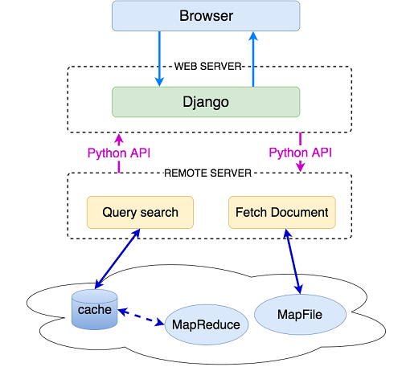
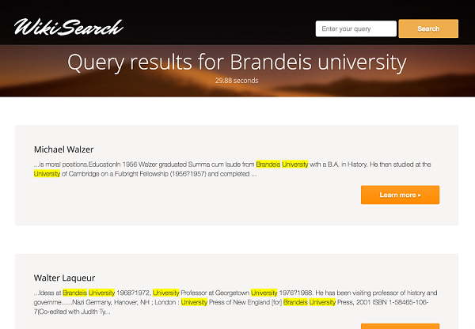

# Wiki Search based on Hadoop
Wiki Search is user-friendly search engine using MapReduce framework. The search engine supports fast speed query by applying index compression and clever partition. Moreover, it can understand and parse query in conjunctive normal form and the results are well ranked by giving different scores for AND, OR and PHRASE operations. After the search results come up, all the keywords except those marked by NOT in the query will be highlighted in the documents in a dynamic ways.

## Architecture Desingn

## UI
The entrance of the search engine-search bar:

The result page:

The detail page:

## Main Work
I implemented the corpus building, query partition, conjunctive norm form analysis and result ranking parts. 
